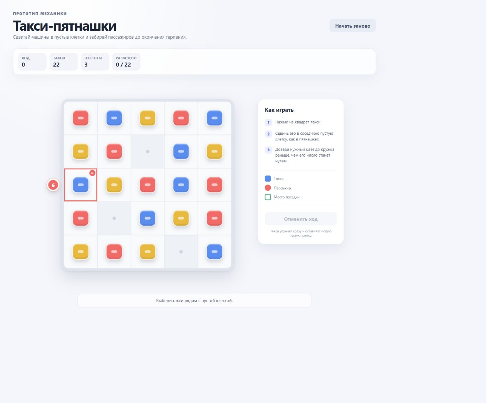

# 1. Граница прототипа

Проверяем, заставляют ли три пустые клетки и одновременные цветные дедлайны
переставлять нецелевые такси ради маршрута пустоты. Минимальный цикл состоит из
поля `5×5`, 22 одно-клеточных такси трёх цветов, трёх пустых клеток, пассажиров
на краях, пошагового терпения и немедленного выезда совпавшего такси.

Реализуем пять авторских уровней. Не реализуем свободную генерацию уровней во
время игры, разные размеры поля, препятствия, специальные такси, повороты,
бустеры, ожидание хода и отмену.

Kill-критерий проверяет, нужна ли центральная перестановка «не моего» цвета.
Если четыре уровня проходятся прямым движением целевых такси, это не плохой
баланс отдельной раскладки, а отсутствие заявленного пятнашечного решения.

# 2. Цель и основной цикл

Цель игрока — обслужить 22 пассажиров и убрать с поля все 22 такси. Первое
доступное действие — выбрать такси, соседнее хотя бы с одной пустой клеткой.

Повторяющийся цикл:

```text
Увидеть цвет, место посадки и терпение активных пассажиров
→ выбрать такси и соседнюю пустую клетку
→ сдвинуть такси, уменьшив терпение ожидающих пассажиров
→ при совпадении цвета немедленно увезти пассажира и убрать такси с поля
→ активировать следующую авторскую волну заявок
→ проверить победу или поражение по §5
```

# 3. Объекты и состояние

| Объект | Состояния | Изменения | Ограничения |
|---|---|---|---|
| Клетка | занята такси; пустая | освобождается при сдвиге или выезде; занимается при сдвиге | одна клетка содержит не более одного такси |
| Такси | цвет `red`, `blue` или `yellow`; координата; на поле или уехало | сдвигается на соседнюю пустую клетку; исчезает после посадки | занимает одну клетку; одно такси обслуживает одного пассажира |
| Пассажир | в очереди; ожидает; обслужен; ушёл | активируется авторской волной; теряет терпение после валидного сдвига; обслуживается совпавшим такси | находится снаружи поля у одной краевой клетки; два активных пассажира не используют одну клетку |
| Место посадки | сторона поля и индекс клетки на стороне | освобождается и занимается обычными сдвигами | пассажир не занимает клетку и не блокирует движение |
| Волна | ещё не активна; активна; завершена | активируется после заданного числа обслуженных пассажиров | порядок и состав фиксированы уровнем |

Пространство — ортогональная сетка `5×5`. Координаты: `x = 0..4` слева
направо, `y = 0..4` сверху вниз. Соседними считаются клетки с манхэттенским
расстоянием `1`; диагональ соседством не является.

На старте каждого уровня находятся 22 такси и ровно 3 пустые клетки. Цветовой
состав — 8 красных, 7 синих и 7 жёлтых такси. Очередь содержит столько же
пассажиров каждого цвета.

```ts
type Color = 'red' | 'blue' | 'yellow';

type TaxiState = {
  id: string;
  color: Color;
  x: 0 | 1 | 2 | 3 | 4;
  y: 0 | 1 | 2 | 3 | 4;
};

type PassengerState = {
  id: string;
  color: Color;
  target: { side: 'top' | 'right' | 'bottom' | 'left'; index: 0 | 1 | 2 | 3 | 4 };
  patience: number;
  initialPatience: 3 | 4 | 5 | 6;
  status: 'queued' | 'waiting' | 'served' | 'left';
};

type WaveState = {
  unlockAfterServed: number;
  passengerIds: string[];
};

type GameState = {
  taxis: TaxiState[];
  passengers: PassengerState[];
  waves: WaveState[];
  selectedTaxiId: string | null;
  moves: number;
  served: number;
  status: 'playing' | 'won' | 'failed';
};
```

# 4. Ввод и правила

```ts
type Action =
  | { type: 'tap-taxi'; taxiId: string }
  | { type: 'tap-cell'; x: number; y: number };
```

Перетаскивания, свайпа, долгого нажатия, кнопки ожидания и undo нет.

| Действие | Условие | Изменение состояния | Видимый результат | Ход потрачен |
|---|---|---|---|---|
| Тап по такси | рядом есть пустая клетка | `selectedTaxiId` становится id такси | такси приподнимается; допустимые пустоты подсвечиваются | нет |
| Тап по зажатому такси | рядом нет пустой клетки | состояние не меняется | короткий `invalidShake`; допустимые клетки не появляются | нет |
| Тап по выбранному такси | такси уже выбрано | `selectedTaxiId = null` | подсветка снимается | нет |
| Тап по другому подвижному такси | другое такси выбрано | выбор переносится на новое такси | старая подсветка снимается, новая появляется | нет |
| Тап по пустой клетке | клетка соседняя с выбранным такси | такси переходит в клетку; прежняя клетка становится пустой; `moves += 1` | такси снапается в новую клетку | да |
| Тап по пустой клетке | клетка не соседняя или такси не выбрано | состояние не меняется | подсказка допустимого хода остаётся | нет |
| Тап мимо поля или HUD | всегда | состояние не меняется | ничего | нет |
| Любое действие | `status !== 'playing'` | состояние не меняется | ввод заблокирован | нет |

После каждого валидного сдвига выполняется автоматическая последовательность
из §5. Такси может ехать только в пустую клетку; перепрыгивание, обмен двух
такси, диагональный ход и перемещение сразу на несколько клеток запрещены.

Если сдвинутое такси оказалось на месте активного пассажира того же цвета,
посадка происходит немедленно. Такси и пассажир исчезают до уменьшения
терпения остальных пассажиров; выезд не расходует дополнительный ход.

# 5. Победа, поражение и переходы

## Победа

```text
Дано: на поле не осталось такси, все 22 пассажира обслужены, очередь и активные волны пусты.
Когда: завершена автоматическая обработка последнего валидного сдвига.
Тогда: попытка заканчивается победой и вызывается onComplete().
```

## Поражение

```text
Дано: хотя бы один пассажир имеет status = waiting.
Когда: после валидного сдвига его patience уменьшается до 0, а подходящее такси не обслужило его этим же сдвигом.
Тогда: попытка заканчивается поражением с причиной passenger_timeout.
```

Порядок автоматической обработки валидного сдвига:

1. Завершить перемещение выбранного такси.
2. Если цвет такси совпал с пассажиром у этой клетки, пометить пассажира
   обслуженным и убрать такси с поля.
3. Уменьшить терпение всех остальных ожидающих пассажиров на `1`.
4. Если терпение хотя бы одного пассажира равно `0`, зафиксировать поражение.
5. Активировать все волны, чей `unlockAfterServed` достигнут.
6. Если новый пассажир появился напротив уже стоящего такси своего цвета,
   обслужить его немедленно без хода; авторские уровни ОБЯЗАНЫ избегать таких
   бесплатных совпадений.
7. Повторять п.5–6, пока новые бесплатные совпадения не закончились.
8. Проверить победу.
9. Снять выбор и вернуть ввод игроку.

Runtime RNG нет. Раскладка, цвета, места посадки, терпение и моменты активации
волн полностью заданы уровнем. Косметические частицы могут различаться.

# 6. Контент и кривая сложности

Уровни авторские; солвер ОБЯЗАН подтвердить возможность обслужить каждого
пассажира до нуля. Один пассажир соответствует одному такси, поэтому итоговые
счётчики цветов в очереди и на поле совпадают.

Пример данных уровня:

```json
{
  "id": 1,
  "grid": { "w": 5, "h": 5 },
  "taxis": [
    { "id": "r1", "color": "red", "x": 0, "y": 0 },
    { "id": "b1", "color": "blue", "x": 1, "y": 0 }
  ],
  "emptyCells": [{ "x": 2, "y": 1 }, { "x": 1, "y": 3 }, { "x": 3, "y": 4 }],
  "passengers": [
    {
      "id": "p1",
      "color": "red",
      "target": { "side": "left", "index": 2 },
      "initialPatience": 6
    }
  ],
  "waves": [
    { "unlockAfterServed": 0, "passengerIds": ["p1"] },
    { "unlockAfterServed": 1, "passengerIds": ["p2"] }
  ]
}
```

В полном файле каждого уровня массив `taxis` содержит 22 объекта, ровно три
клетки отсутствуют в массиве, а `passengers` содержит 22 заявки: `8/7/7` по
цветам.

| Уровень | Старт и волны | Новый навык | Главное давление | Ожидаемый сложный момент | Условие валидности |
|---:|---|---|---|---|---|
| 1 | 1 активный пассажир; терпение `6` | понять пустоту и немедленный выезд | теснота стартового поля | первый вспомогательный сдвиг другого цвета | каждый пассажир решается с запасом минимум в 1 ход |
| 2 | до 2 активных; терпение `5–6` | выбирать порядок двух заявок | общий расход ходов | короткий маршрут менее срочного мешает срочному | хотя бы один порядок заявок проигрышный, другой победный |
| 3 | до 3 активных; терпение `4–6` | планировать пустоту на два действия вперёд | пересекающиеся маршруты | требуется освободить занятую краевую клетку | минимум две обязательные перестановки нецелевого цвета |
| 4 | до 3 активных; терпение `4–5` | использовать новую пустоту от выехавшего такси | порядок исчезновения машин | первый выезд должен открыть маршрут второму | без правильного порядка хотя бы один пассажир уходит |
| 5 | до 4 активных; терпение `3–5` | объединить приоритет, маршрут и цепочку выездов | четыре дедлайна | спасение двух заявок последовательностью через одну новую пустоту | солвер подтверждает победу и минимум три обязательных нецелевых сдвига |

Разница `1→2`: появляется выбор порядка пассажиров. `2→3`: маршрут пустоты
становится длиннее одного подготовительного сдвига. `3→4`: освобождённая
такси клетка становится частью следующего решения. `4→5`: одновременно
активны все три цвета и до четырёх дедлайнов.

# 7. Обратная связь и обучение

- Доступное действие: после выбора такси соседние пустые клетки получают
  пульсирующую точку; зажатое такси не поднимается.
- Запрещённое действие: `invalidShake` выбранного такси, таймеры не меняются.
- Цена хода: после снапа у каждого ожидающего пассажира число уменьшается на
  один; число `1` пульсирует красным независимо от цвета заявки.
- Победа: последнее такси выезжает, поле остаётся пустым, затем появляется
  итог попытки.
- Поражение: круг пассажира гаснет и уходит за край; просроченное место
  подсвечивается, затем показывается fail.
- Payoff: пассажир соединяется с совпавшим такси, такси за `220 мс` уезжает
  за край, а его клетка вспыхивает как новая пустота. Ввод разблокируется
  после завершения выезда.
- Без текста игрок должен понять: двигаются только такси рядом с пустотой;
  квадрат и круг одинакового цвета связаны; исчезнувшее такси создаёт место.
- Подсказка `?`: «Сдвигай такси в соседние пустые клетки. Подай нужный цвет к
  пассажиру до нуля. Такси с пассажиром сразу уезжает» — не больше трёх строк.

Цвет дублируется знаком внутри объекта: красный — круг, синий — квадрат,
жёлтый — треугольник. Один и тот же знак находится на такси, пассажире и
контуре места посадки.

Онбординг:

1. «Три серые клетки свободны» — одна пустота подсвечивается.
2. «Нажми соседнее такси, затем пустую клетку» — выполняется первый сдвиг.
3. «Каждый сдвиг уменьшает числа пассажиров» — число анимируется `6 → 5`.
4. «Цвет и знак показывают нужное такси» — связываются пассажир и машина.
5. «Доедь до края раньше нуля» — первый пассажир обслуживается.
6. «Уехавшее такси оставляет новую пустоту» — новая клетка подсвечивается.

## 7.1. Экран — как выглядит поле



Сверху расположены название и HUD: ход, оставшиеся такси, число пустот и
обслуженные пассажиры. Центральные 65–70% высоты занимает квадратное поле
`5×5`; пассажиры-круги стоят снаружи напротив своих краевых клеток. Ниже поля
находятся короткое правило и статус последнего действия.

За секунду должны читаться три пустоты, самый маленький таймер, цвет/знак
каждого пассажира и его клетка посадки. Payoff происходит на краю поля: такси
соединяется с кругом, выезжает наружу, а занятая клетка становится четвёртой
пустотой.

# 8. Проверка прототипа

```yaml
playtest:
  sample: 10-15
  success:
    first_action_without_help: ">=80%"
    goal_understood: ">=75%"
    voluntary_continue: ">=60%"
    retry_after_fail: ">=50%"
  mandatory:
    - минимум четыре уровня требуют сдвига такси нецелевого цвета
    - минимум один игрок словами объясняет план подвода пустой клетки
    - уровни 2–5 создают разные решения, а не только более короткие таймеры
  kill:
    - выполняется заранее записанный kill_criterion
```

Первое валидное действие — первый завершённый сдвиг такси в соседнюю пустую
клетку. Выбор такси без сдвига не вызывает `onFirstAction()`.

Для проверки гипотезы в локальном логе уровня сохраняются цвета всех
сдвинутых такси и активные пассажиры на момент сдвига. Метрика
`support_move_rate` — доля валидных сдвигов такси цвета, которого нет у
самого срочного пассажира. Это диагностическая метрика; решение Gate 2
принимается по наблюдаемому поведению и kill-критерию, а не по одному числу.

Общее правило проверки на игроках — `results/gate2.md`.

---

# Приложение A. Профиль реализации

**`game.config.ts`.** `id: 'two-moves-later'`, `title: 'Такси-пятнашки'`,
`tagline: 'Сдвигай такси и успевай к пассажирам'`, `levelCount: 5`.
`version` и `onboarding.version` увеличиваются при изменении правил и
онбординга соответственно.

**Контракт.** Механика реализует `MechanicHost`, вызывает `onFirstAction()`
при первом валидном сдвиге, `onComplete()` после очистки поля,
`onFail('passenger_timeout')` при нулевом терпении и `onExit()` при выходе.
PostHog напрямую не используется.

Shell логирует `game_open`, `help_open`, `level_start`, `level_win`,
`level_fail`, `retry`, `rating_submit`, `comment_submit`. Для
`level_fail.reason` допустимо только значение `passenger_timeout`.

**`data-testid`.** `game-surface` — контейнер, `mechanic-hud` содержит
`data-remaining` с количеством такси; интерактивные клетки —
`cell-{x}-{y}`, такси — `taxi-{id}`, подсказка — `help-button`.

**Эффекты.** `punch` при выборе такси, `invalidShake` при невозможном ходе,
`moveTo` для сдвига и выезда, `fadeCollapse` для пассажира, `successFlash`
для новой пустоты, `cameraShake` только при поражении.

**UI kit.** HUD с четырьмя счётчиками, стандартный help-попап, fail/win
попапы и кнопка выхода. Игра запускается в браузере телефона без установки;
прогресс, оценка и аналитика принадлежат общему shell.
